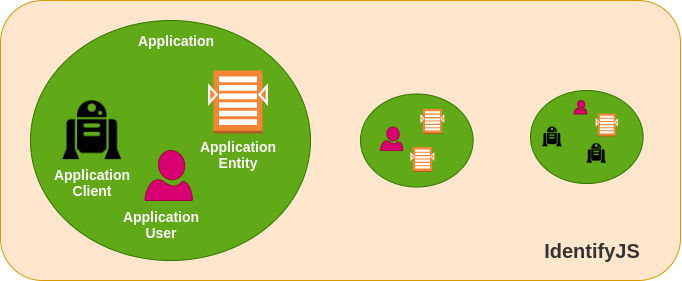
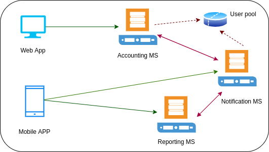
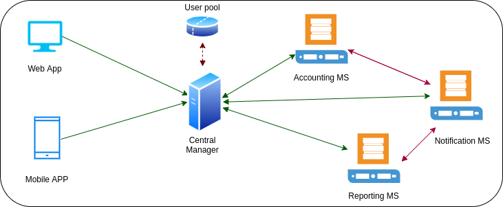
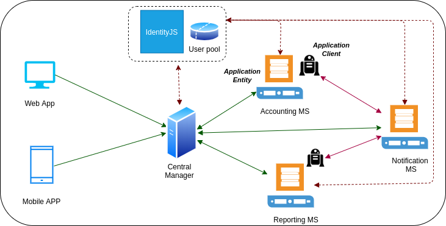

# IdentityJS

> Identity redefined

## What is IdentityJS?

IdentityJS is an open source application which makes "Authentication and Authorization" simple and secure . With the new micro-services architectures where a lot of components talk to each other authentication and authorization becomes a nightmare. Maintenance of user pool each an every component and secure them has become a real burden as well as time consuming task. 

With IdentityJS we make your life simple by keeping single user pool with delegated and user friendly user management mechanism. The Seamless Integration between IdentityJS and the fellow components makes the development much faster and error free.

## Basics of IdentityJs

This identity provider has been developed with four main components.

1. Application
2. Application Entity
3. Application Client
4. Application User

Graphical representation of the four components

As the diagram shows, Application can have multiple application clients, entities and users. In IdentityJS we can have multiple applications as well. Keep in mind this separation of entities has been introduced to make the authentication and authorization process user friendly. With this separation of concerns even for a wel-developed application with large number of components can be easily integrated with IdentityJS without much efforts.

### Application
Application represents the biggest singleton component in the IdentityJS. As the name suggests it represents an real world application. Basically it represents a real world application. As an example we can take GitHub. In our IdentityJS "GitHub" can be considered as a single application. Normally a company owns more than one application. To maintain all these applications one IdentityJS server is more then enough :-).

### Application Entity
Even-though end user see an application as a single entity, the reality is there are bunch of components that talks to each other. Since it happens under the hood end user doesn't see that. But most of the time when end user hits a button in the UI, an API call is made to one of the Micro-Services (components) and it'll reply back. So these components are represented as Application entities in IdentityJS. In simple terms these application entities are the 
entities that authentication and authorization is required. 

### Application User
End users of the application are represented by this component.

### Application Client
In the world of Micro Services, those components have to talk each others to get the things done on behalf of the end users. When they do that they represents the end user indirectly. With IdentityJS micro-services can use these application clients to perform the communication safely between each other. In IdentityJS context, Application Entities would use Application Clients to perform secure communication each other.

## Real World Case Study 
Let's discus how an existing application can be integrated with IdentityJS. Our sample application is online banking service application. For the simplysity let's say it has 3 micro-services. 
1. Account Micro-Service 
2. Reporting Micro-Service
3. Notification Micro-Service

First how the application would be without IdentityJS. There can be basically two types. 
1. Legacy Type

As the name suggests this design is bit old. The major drawback with this is each an every micro-service should have an auth layer and connection to the use database. (Not good!). So it's a waste of time in development and additional work on micro-service as well. 

2. Modern Type 

With this modern approach there is central server that maintain authentication and authorization for micro-services. This is better then legacy approach but has some weakness. Micro-services doesn't have any authorization or authentication so they can't expose separately. The biggest problem is authorization information has to be passed with the request from central server to micro-services. If certain request goes through more than one micro-service all the authorization information would have to be passed via all the micro-services. 

Let's discuss how this IdentityJS can be plugged with both of these types. 

1. Legacy Type with IdentityJS

2. Modern Type with IdentityJS

